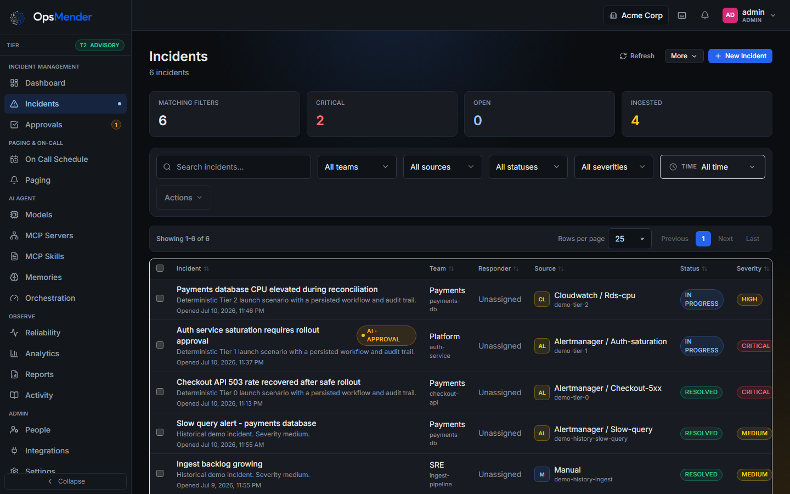
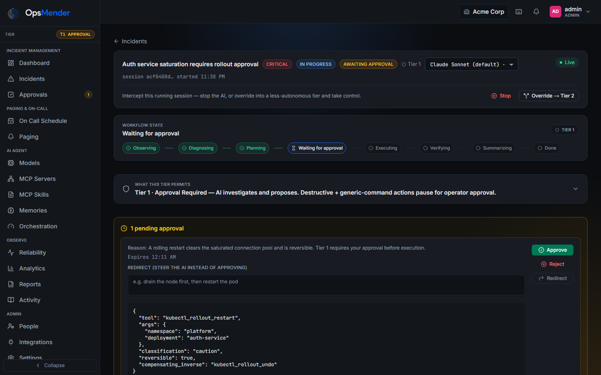
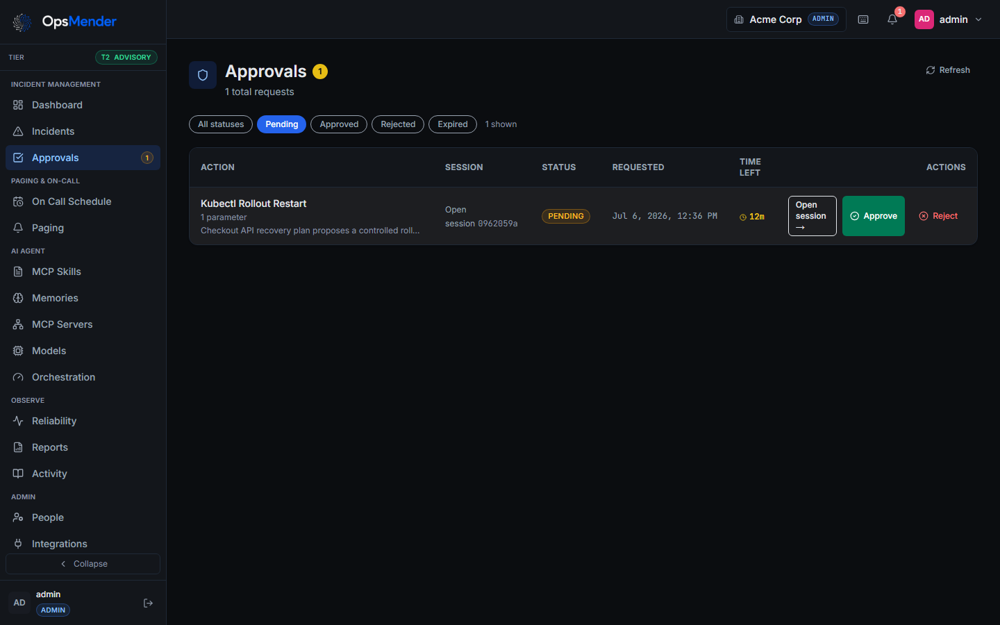
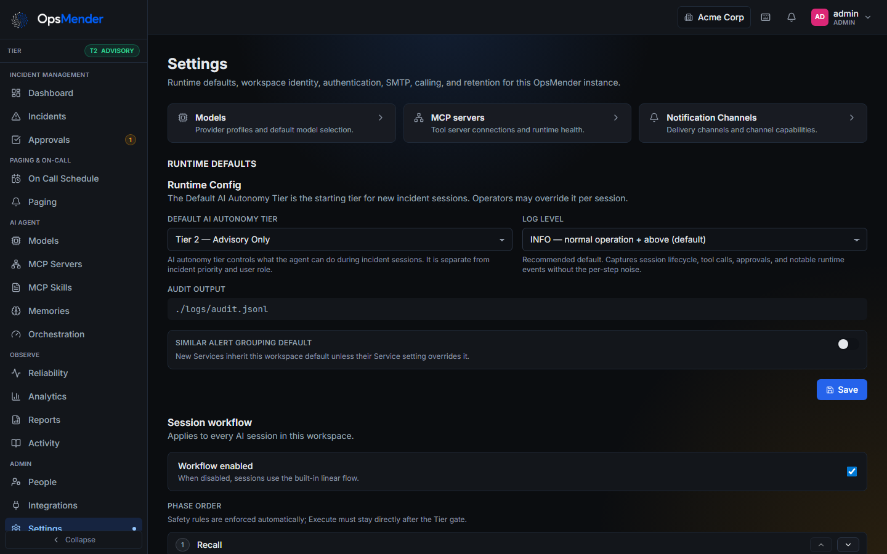
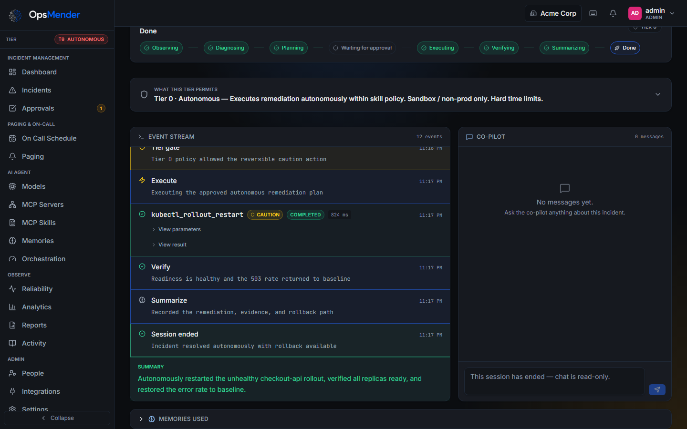
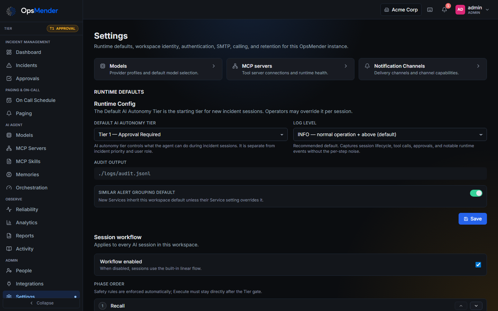
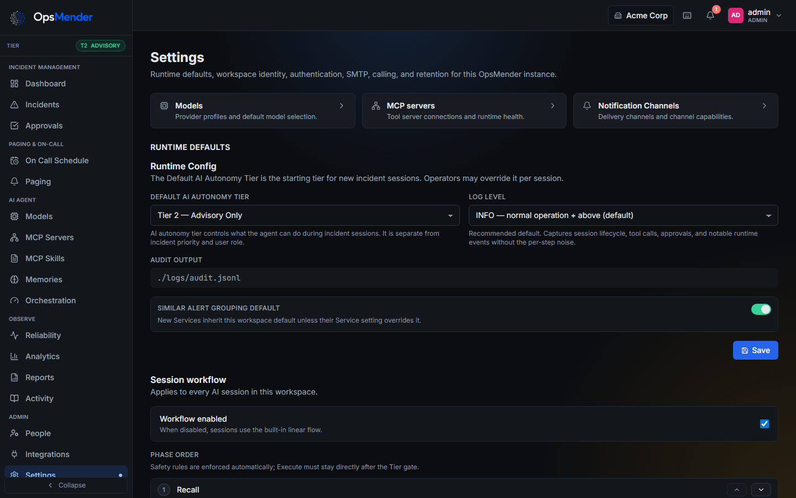
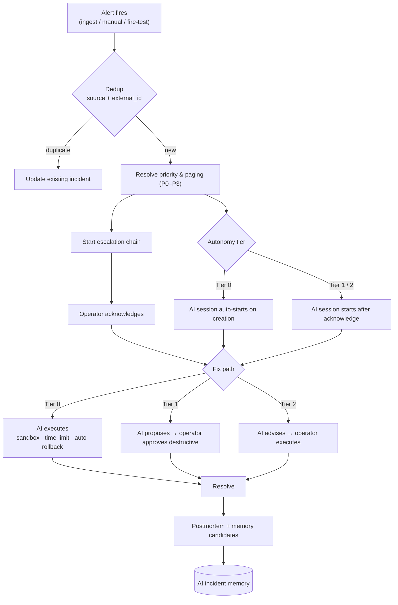

# OpsMender AI

[](LICENSE)
[](https://www.python.org/downloads/)
[](https://nodejs.org/)
[](https://github.com/SpicyDaemon/OpsMender-AI/releases)

> Incident response you run on your own servers. Track incidents, page the right people, and let an AI agent investigate and fix things within limits you set in code.

📚 **[Wiki](docs/wiki/README.md)** · 🌐 **[Website](https://spicydaemon.github.io/OpsMender-AI/)** · 🤝 **[Contributing](CONTRIBUTING.md)**

---

## What it is

OpsMender is an open source incident response platform for engineering teams.
You install it on your own infrastructure, invite your on call operators,
connect a model, and point your monitoring at it.

When an incident comes in, OpsMender pages the right people through escalation
chains and rosters. An operator can start an AI session on the incident. The
agent reaches your systems through [MCP](https://modelcontextprotocol.io)
servers you provide or through [native integration connectors](#native-integration-connectors),
and it can only do what a skill file and a three tier autonomy policy allow.

The tier gate lives in the backend. It checks every tool call before it runs.
The model cannot reason its way past it, and anything the skill does not name
is denied.

Every incident follows the same loop: alert, investigate, acknowledge, fix,
resolve. A full audit trail and a postmortem draft come out the other end.

Start simple: one workspace, email and password, admin invites. OIDC, SAML,
and TOTP are there when you need them.

## Screenshots

| Incident command center | Live AI session |
| --- | --- |
|  |  |
| Prioritize, assign, combine, and start AI help from the incidents list. | Watch the agent workflow, operator controls, memory, chat, and tool activity in one place. |

| Approval inbox | Settings |
| --- | --- |
|  |  |
| Review Tier 1 actions with context before anything runs. | Configure workspace policy, session workflow, notifications, models, and guardrails. |

**AI autonomy tiers** — the tier gate is enforced in code. Set the default per workspace and override it per session.

| Tier 0 · Autonomous | Tier 1 · Approval Required | Tier 2 · Advisory (default) |
| --- | --- | --- |
|  |  |  |
| **Executed autonomously:** restarted the unhealthy deployment, verified recovery, and recorded its compensating inverse. | **Paused for approval:** completed diagnosis, proposed a reversible write, and ran nothing until an operator decides. | **Advised only:** ran read-only diagnostics and delivered a change-window plan without altering infrastructure. |

## Features

- **Three-tier AI autonomy** — Tier 0 Autonomous (sandbox + time limits + auto-rollback), Tier 1 Approval-Required, Tier 2 Advisory-Only (default).
- **Programmatic tier gate** — enforced in code before any tool runs; not prompt-bypassable.
- **MCP-first + native integrations** — operator-provided MCP servers remain the
  general execution path; encrypted connectors add capability-scoped tools for
  source control, tickets, docs, observability, and infrastructure.
- **Org-owned skills** — bind `SKILL.md` policy to an MCP server or native
  integration connector so every discovered operation has explicit T0/T1/T2
  behavior plus active-tier operating instructions. Unknown operations fail
  closed.
- **Incident management** — P0–P3 priority, dedup, **combine/merge**, escalation chains, rosters + a team **On Call Schedule** (timezone-aware shifts, click-a-person coverage overrides), maintenance windows.
- **Similar alert grouping** — optional per-service grouping folds similar alerts into the open incident instead of paging again; automatic flapping detection suppresses repeat pages during fire/clear storms (**P0 always pages**).
- **On-call paging** — verified Slack, Teams, and Discord incident actions,
  plus Email / SMS / Voice Call delivery and per-incident channels; the voice
  IVR keypad does 1 acknowledge / 2 escalate / 3 resolve.
- **Shared incident tracking** — update-in-place Slack, Discord, and Google
  Chat status, Teams follow-ups, and versioned AWS EventBridge lifecycle
  events.
- **Incident reporting** — on-demand CSV/PDF metrics plus scheduled
  weekly/monthly/quarterly email reports from organization SMTP.
- **Operational analytics** — read-only **Noise** (alert volume, reduction ratio,
  noisiest services) and **Response** (MTTA/MTTR trends by service and priority)
  dashboards, each with CSV export.
- **[Native integration connectors](#native-integration-connectors)** — 26 kinds
  covering source control, tickets, docs, CI/CD, infrastructure, and
  observability. Typed capabilities rather than raw API access, encrypted auth,
  guided per-provider setup fields, self-hosted API URLs where applicable, and
  approval-locked merges.
- **Bi-directional ticket state** — linked Jira and ServiceNow tickets mirror
  mapped incident status in both directions through non-blocking outbound jobs
  and signed inbound webhooks.
- **CI/CD integrations** — Jenkins, CircleCI, and Azure Pipelines expose build,
  job, pipeline, and run status while triggers remain approval-gated.
- **Infrastructure automation** — Terraform Cloud, Argo CD, and Ansible
  Automation expose workspace, run, application, diff, template, and job
  context; every plan/apply, sync/rollback, or launch requires approval.
- **Kubernetes context and remediation** — encrypted API access for pods,
  events, logs, and deployments; rollout restarts and pod deletion remain
  approval-gated.
- **Inbox** — per-user 🔔 bell notification feed with live updates, deep links, per-category mute, and quiet hours.
- **Universal alert ingest** — native Sentry, New Relic, Splunk, Rollbar,
  BugSnag, Elastic/OpenSearch, Honeycomb, Dynatrace, AppDynamics, Loki, and
  cloud-monitor parsing plus auto-learned JSON webhooks.
- **AI incident memory** — lessons from past incidents injected into the agent's prompt; advisory, workspace-scoped, operator-curated.
- **Reliability / SLA** — HTTP/TCP uptime checks, response-time history, SLO-breach recommendations.
- **Audit everything** — every tool call, approval, rollback, and state transition recorded.
- **Supply-chain security baseline** — CycloneDX SBOM generation, high/critical
  container scanning, CodeQL, Dependabot, and digest-only image-signing
  guidance are included for self-hosted security review.
- **RBAC + workspace auth** — Admin / Operator / Viewer, local accounts, optional OIDC/SAML, custom domains, and workspace-scoped data boundaries.
- **Named API tokens** — revocable, role-scoped bearer tokens for REST API automation without a human session.
- **Local-account MFA** — encrypted TOTP enrollment, one-time recovery codes,
  and optional organization-wide enforcement.
- **Dashboard** — Next.js console with a `Cmd/Ctrl-K` command palette.

## Architecture


- **Backend** (`backend/`) — FastAPI + async SQLAlchemy, the LangGraph workflow, the MCP client/pool, the tier gate, paging engine, SLA poller, and audit log. Alembic migrations run on startup.
- **Frontend** (`frontend/`) — Next.js (React 19 + Tailwind 4) built as a **static export** and served by the backend on the same origin.
- **CLI** (`cli/`) — `opsmender serve | check | run | config | approvals | audit`.
- **Database** — SQLite for local dev (zero-config), PostgreSQL 16+ for production.

## How it works — incident lifecycle



Resolved sessions feed a continuous memory loop: validated lessons are
immediately recallable in later sessions, with no approval or hidden state.
Memories compact independently per service after the 50-memory threshold.
Admins can manage every memory; operators can edit/delete memories owned by
their teams, including confirmed bulk deletion from the Memories table.
Resolved is the final incident status. The Incidents table provides
selection-driven Actions for confirmed resolve, reopen, combine, and
admin-only permanent deletion.

## Quickstart (5 minutes)

Requires [Docker](https://docs.docker.com/get-docker/) with Compose.

```bash
git clone https://github.com/SpicyDaemon/OpsMender-AI.git
cd OpsMender-AI
cp .env.example .env          # dev defaults work as-is
docker compose -f docker/docker-compose.yml up --build
```

Open **http://localhost:8000** and sign in with **`admin` / `admin123`** (development only).

```bash
# stop
docker compose -f docker/docker-compose.yml down
# stop + wipe the database
docker compose -f docker/docker-compose.yml down -v
```

## Development setup

Requires **Python 3.12+**, **Node 24+**, and [`uv`](https://docs.astral.sh/uv/).

```bash
# Backend — SQLite, auto-migrates, seeds admin/admin123, serves the built UI on :8000
uv sync --dev
uv run python scripts/dev_server.py

# Frontend — hot-reloading dev server on :3000, proxies the API to :8000
cd frontend && npm install && npm run dev
```

Tests:

```bash
uv run python -m pytest -q          # backend (SQLite, no Postgres needed)
cd frontend && npm test             # frontend (vitest)
cd frontend && npm run build        # production build must stay clean
```

End-to-end **manual-QA walkthrough** (drives the real UI in a browser and reports per-step pass/fail): see **[`qa/README.md`](qa/README.md)**.

## Production setup

### Docker Compose (recommended)

Set production values in `.env`, then bring it up detached:

```dotenv
OPSMENDER_DEPLOYMENT_MODE=monolith
OPSMENDER_ENVIRONMENT=production
OPSMENDER_JWT_SECRET=<64+ random chars>      # e.g. openssl rand -hex 32
OPSMENDER_BOOTSTRAP_ADMIN_EMAIL=you@example.com
OPSMENDER_BOOTSTRAP_ADMIN_PASSWORD=<strong password>
OPSMENDER_PUBLIC_BASE_URL=https://opsmender.example.com
# Defaults to the bundled Postgres; point at RDS/Cloud SQL/etc. to use your own:
OPSMENDER_DATABASE_URL=postgresql+asyncpg://opsmender:opsmender@db:5432/opsmender
```

```bash
docker compose -f docker/docker-compose.yml up --build -d
```

Platform-neutral probes are available on the application port:

- `GET /health/live` reports whether the process is running and never touches
  PostgreSQL or optional integrations.
- `GET /health/ready` reports readiness to receive traffic and requires a
  reachable PostgreSQL database at the current Alembic revision.
- `GET /health` remains a backward-compatible alias of `/health/live`.

Production mode **refuses to start** with a placeholder JWT secret, a missing or
non-PostgreSQL database URL, a known weak bootstrap password, or an invalid
autonomy tier. It warns without blocking when CORS is wildcarded, the public
base URL is unset, or interactive API docs are enabled. Put a TLS-terminating
proxy (nginx, Caddy, Cloudflare) in front of port 8000.

### Standalone binary

Download the Linux/Windows binary (with `.sha256`) from [**Releases**](https://github.com/SpicyDaemon/OpsMender-AI/releases), or build it with `bash scripts/build_binary.sh`. It bundles the Python runtime, the static frontend, migrations, and skills (Node.js is **not** bundled — install `node`/`npx` if your MCP servers need it).

For a quick local evaluation, run the binary with no database configuration:

```bash
./opsmender serve
```

This creates `./opsmender.db` with SQLite, starts the dashboard on
**http://localhost:8000**, and uses the development-only `admin` / `admin123`
login on a new database. SQLite is for local evaluation only. **PostgreSQL is
required for production.**

For production, configure PostgreSQL and the required security settings:

```bash
OPSMENDER_DEPLOYMENT_MODE=monolith \
OPSMENDER_ENVIRONMENT=production \
OPSMENDER_JWT_SECRET=$(openssl rand -hex 32) \
OPSMENDER_DATABASE_URL=postgresql+asyncpg://user:pw@host/opsmender \
OPSMENDER_BOOTSTRAP_ADMIN_EMAIL=you@example.com \
OPSMENDER_BOOTSTRAP_ADMIN_PASSWORD='<strong password>' \
./opsmender serve
```

<details>
<summary><b>Kubernetes &amp; cloud</b></summary>

- **Helm** — `deploy/helm/opsmender` (auto-generates the JWT secret, supports an external Postgres, Ingress + TLS).
- **Cloud IaC** — `deploy/cloud/`: AWS ECS Fargate, Azure Container Apps, GCP Cloud Run, OCI Container Instances.

</details>

## Configuration

All configuration is via environment variables; [`.env.example`](.env.example) documents every option. The essentials:

| Variable | Prod | Default | Purpose |
|---|---|---|---|
| `OPSMENDER_DEPLOYMENT_MODE` | ✅ | `monolith` | `monolith` or `distributed`; legacy `development`/`production` select monolith. |
| `OPSMENDER_ENVIRONMENT` | ✅ | `production` | `development` permits local defaults; `production` enforces startup guards. |
| `OPSMENDER_SERVICE_ROLE` | Distributed | `api` | `api`, `worker`, `scheduler`, or `dispatcher`. |
| `OPSMENDER_JWT_SECRET` | ✅ | — | Session-token signing key (64+ random chars). |
| `OPSMENDER_DATABASE_URL` | ✅ | SQLite file | `postgresql+asyncpg://…` for production. |
| `OPSMENDER_BOOTSTRAP_ADMIN_EMAIL` / `…_PASSWORD` | ✅ | `admin`/`admin123` (dev) | First admin account. |
| `OPSMENDER_PUBLIC_BASE_URL` | ➕ | — | Base URL for invite / reset links. |
| `OPSMENDER_TIER` | ➕ | `2` | Default AI autonomy tier (`0`/`1`/`2`). |
| `OPSMENDER_TWILIO_ACCOUNT_SID` / `…_AUTH_TOKEN` / `…_FROM_NUMBER` | ➕ | — | Optional Voice/SMS bootstrap; Settings -> Voice & SMS calling overrides env values. |
| `OPSMENDER_TWILIO_VOICE_FROM_NUMBER` | ➕ | SMS number | Optional dedicated Voice Call number. |
| `OPSMENDER_TWILIO_VOICE_STATUS_CALLBACK_URL` | ➕ | — | Optional provider status callback URL for Voice Call delivery. |
| `AUDIT_RETENTION_DAYS` | ➕ | `90` | Hot audit-entry retention before pruning or archival. |
| `AUDIT_ARCHIVE_ENABLED` | ➕ | `false` | Archive expired audit entries to S3-compatible storage before deletion. |
| `ANTHROPIC_API_KEY` / `OPENAI_API_KEY` / … | ➕ | — | Only for the model providers you enable. |

For the four-process topology:

```bash
docker compose -f docker/docker-compose.distributed.yml up --build -d
```

The API is exposed on port 8000. External incident/chat callback ingress is
exposed by the dispatcher on port 8001; route those webhook paths there.

<details>
<summary><b>First-login checklist (production)</b></summary>

1. **Models** (`/dashboard/models`) — add a model, optionally cap concurrent
   incident sessions (`0` = unlimited), set a default, and run **Test connection**.
2. **Infrastructure tools** — connect an MCP server
   (`/dashboard/mcp-servers`) and/or an encrypted native integration
   (`/dashboard/integrations`). A service may use either source.
3. **Skills** (`/dashboard/skills`) — create or import a `SKILL.md`, bind it to
   an MCP server or native integration, and review its per-tier operation
   policy.
4. **Services / Teams / Rosters / Escalation** (`/dashboard/paging/*`) — define routing and on-call.
5. **On Call Schedule** (`/dashboard/on-call-schedule`) — see who's on call per level, replace coverage, and view shifts in any time zone.
6. **Notification channels** (`/dashboard/paging/notifications`) — Slack /
   Teams / Discord / Email / SMS / Voice Call.
7. **Voice & SMS calling** (`/dashboard/config`) — optional phone/SMS delivery settings; env variables can bootstrap, saved Settings values win.
8. **People** (`/dashboard/people`) — invite operators (Admin / Operator / Viewer).
9. **Tier** (`/dashboard/config`) — default is `2` (advisory); raise to `1`/`0` when ready.

</details>

Before an incident is human-handled, if every configured incident-response
model is full, OpsMender keeps the AI session in a durable priority queue (P0
first, FIFO within a priority) while human paging continues normally.
Acknowledgment cancels delayed queued work. Operators can cancel a queued
session or explicitly force a start; force is a soft, audited cap override and
still counts toward occupancy. Queue and approval-hold TTLs are configurable
in `.env.example`.

Signup is email-first; OpsMender derives a display username when public
registration is open. Admin invites expire after 72 hours and support resend
and revoke. After sign-in, dashboard URLs use plain `/dashboard/...` routes for
the single workspace. The login page can switch to OIDC or SAML after the email
field identifies a configured workspace domain.
Local accounts can enable TOTP from **Profile & Settings**. Admins can require
MFA for the active organization; recovery codes are shown once and stored only
as bcrypt hashes.

## Native integration connectors

Twenty six connector kinds ship with OpsMender. Each one exposes typed,
capability-scoped tools rather than a raw API, stores its credentials
encrypted, and is allowlisted per service. Every call passes the same tier
gate, approval flow, and audit log as an MCP tool, so a connector is never a
way around policy.

An MCP server is optional. If your connectors already cover what a service
needs, sessions run on connectors alone.

**Source control**

    

**Tickets, docs, and support**

        

**CI/CD**

  

**Infrastructure**

   

**Observability and status**

   

**Anything else**


Jira and ServiceNow additionally keep ticket state in sync with the incident in
both directions. Self-hosted URLs are supported where the provider allows them,
and merges stay approval locked at every tier.

See the [Skills & MCP guide](docs/wiki/skills-guide.md) for binding a skill to a
connector, and the [Admin guide](docs/wiki/admin-guide.md) for credential setup.

## Project layout

| Path | What |
|---|---|
| `backend/` | FastAPI app, LangGraph workflow, MCP client, tier gate, audit, DB models |
| `frontend/` | Next.js dashboard (static export → `frontend/out/`) |
| `cli/` | `opsmender` CLI |
| `skills/` · `examples/` | Auto-imported skills · `SKILL.md` templates |
| `deploy/` | Helm chart + cloud IaC |
| `docker/` | Dockerfile + docker-compose.yml |
| `qa/` | Playwright manual-QA walkthrough |
| `tests/` | Backend pytest suite |
| `docs/` · `docs/wiki/` | Architecture reference + operator/admin guides |

## Documentation

Start with **[Getting Started](docs/wiki/getting-started.md)**. Other guides: [Admin](docs/wiki/admin-guide.md) · [Auth](docs/wiki/auth-guide.md) / [Advanced auth](docs/wiki/advanced-auth-guide.md) · [Paging](docs/wiki/paging-guide.md) · [Skills & MCP](docs/wiki/skills-guide.md) · [Operator](docs/wiki/operator-guide.md) · [Memory](docs/wiki/memory-guide.md) · [Postmortems](docs/wiki/postmortem-guide.md) · [Reliability](docs/wiki/reliability-guide.md) · [Slack](docs/wiki/slack-paging-surface.md) / [Teams](docs/wiki/teams-paging-surface.md) surfaces.

## Contributing & security

Contributions welcome — see **[CONTRIBUTING.md](CONTRIBUTING.md)** for the local setup, test loop, and the non-negotiable guardrails (tier gate, MCP-first, audit, org-owned skills). Report vulnerabilities per **[SECURITY.md](SECURITY.md)**.

## License

[MIT](LICENSE).

---

<sub>Keywords: AI incident manager · AI incident response · AI SRE · AI on-call · agentic incident response · LangGraph incident response · MCP runbook automation.</sub>
