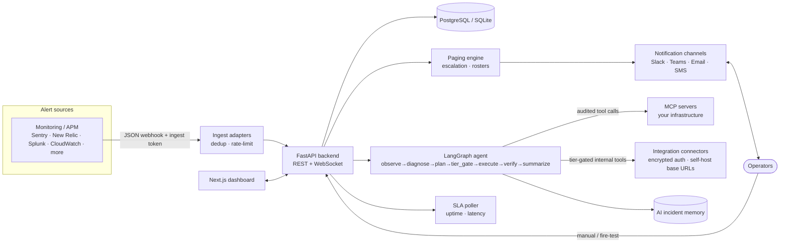
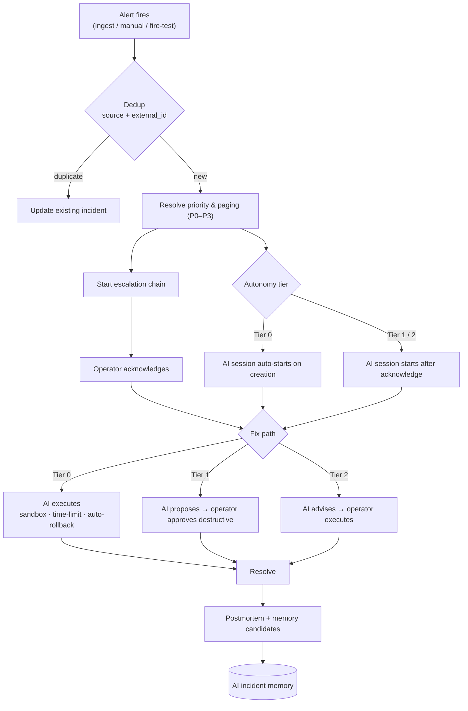

# OpsMender AI

[](LICENSE)
[](https://www.python.org/downloads/)
[](https://nodejs.org/)
[](https://github.com/SpicyDaemon/OpsMender-AI/releases)

> Open-source, self-hosted **AI incident manager / AI SRE / AI on-call** for production infrastructure — **tier-gated, MCP-first, human-in-the-loop**.

📚 **[Wiki](docs/wiki/README.md)** · 🛠 **[Architecture & API](docs/REFERENCE.md)** · 🗺 **[Roadmap](docs/ROADMAP.md)** · 🤝 **[Contributing](CONTRIBUTING.md)**

---

## What it is

OpsMender connects AI agents to **your** infrastructure through
**[Model Context Protocol](https://modelcontextprotocol.io) (MCP) servers** you
provide and encrypted native integration connectors, then enforces a
**three-tier autonomy model** so the agent only does what you allow. MCP tools
use your Skill classifications; native integration capabilities carry explicit
tier policies. The **tier gate is enforced in code** — the agent cannot reason
its way past it.

Install it, invite your on-call operators, connect a model and your MCP servers, point your monitoring at it, and every paged incident walks the same loop:

> **alert → AI → acknowledge → fix → resolve** — with a full audit trail and an authored postmortem at the end.

**Simple by default, enterprise-ready underneath:** start as a single-workspace tool with email + admin invites; multi-tenant, SSO, SAML, and host-isolation are in the box and turn on when you need them.

## Features

- **Three-tier AI autonomy** — Tier 0 Autonomous (sandbox + time limits + auto-rollback), Tier 1 Approval-Required, Tier 2 Advisory-Only (default).
- **Programmatic tier gate** — enforced in code before any tool runs; not prompt-bypassable.
- **MCP-first + native integrations** — operator-provided MCP servers remain the
  general execution path; encrypted connectors add capability-scoped tools for
  source control, tickets, docs, observability, and infrastructure.
- **Org-owned skills** — one `SKILL.md` classifies every operation as safe / caution / destructive.
- **Incident management** — P0–P3 priority, dedup, **combine/merge**, escalation chains, rosters + on-call calendar, maintenance windows.
- **On-call paging** — Slack / Teams / Email / SMS with Acknowledge / Resolve / Escalate actions and per-incident channels.
- **Shared incident tracking** — update-in-place Slack, Discord, and Google
  Chat status, Teams follow-ups, and versioned AWS EventBridge lifecycle
  events.
- **Incident reporting** — on-demand CSV/PDF metrics plus scheduled
  weekly/monthly/quarterly email reports from organization SMTP.
- **Native work-system integrations** — GitHub, GitLab, Bitbucket, Azure
  DevOps, Gitea, Jira, Confluence, ServiceNow, Linear, Notion, Google Docs, and
  Statuspage provide typed
  repository, PR, ticket, record, and document capabilities with encrypted
  auth, self-hosted API URLs where applicable, and approval-locked merges.
- **Bi-directional ticket state** — linked Jira and ServiceNow tickets mirror
  mapped incident status in both directions through non-blocking outbound jobs
  and signed inbound webhooks.
- **CI/CD integrations** — Jenkins, CircleCI, and Azure Pipelines expose build,
  job, pipeline, and run status while triggers remain approval-gated.
- **Infrastructure automation** — Terraform Cloud, Argo CD, and Ansible
  Automation expose workspace, run, application, diff, template, and job
  context; every plan/apply, sync/rollback, or launch requires approval.
- **Kubernetes context and remediation** — encrypted API access for pods,
  events, logs, and deployments; rollout restarts and pod deletion remain
  approval-gated.
- **Inbox** — per-user 🔔 bell notification feed with live updates, deep links, per-category mute, and quiet hours.
- **Universal alert ingest** — native Sentry, New Relic, Splunk, Rollbar,
  BugSnag, Elastic/OpenSearch, Honeycomb, Dynatrace, AppDynamics, Loki, and
  cloud-monitor parsing plus auto-learned JSON webhooks.
- **AI incident memory** — lessons from past incidents injected into the agent's prompt; advisory, per-org, operator-curated.
- **Reliability / SLA** — HTTP/TCP uptime checks, response-time history, SLO-breach recommendations.
- **Audit everything** — every tool call, approval, rollback, and state transition recorded.
- **Supply-chain security baseline** — CycloneDX SBOM generation, high/critical
  container scanning, CodeQL, Dependabot, and digest-only image-signing
  guidance are included for self-hosted security review.
- **RBAC + multi-tenant (opt-in)** — Admin / Operator / Viewer; per-org isolation with per-tenant SSO/SAML.
- **Local-account MFA** — encrypted TOTP enrollment, one-time recovery codes,
  and optional organization-wide enforcement.
- **Dashboard** — Next.js console with a `Cmd/Ctrl-K` command palette.

## Architecture



- **Backend** (`backend/`) — FastAPI + async SQLAlchemy, the LangGraph workflow, the MCP client/pool, the tier gate, paging engine, SLA poller, and audit log. Alembic migrations run on startup.
- **Frontend** (`frontend/`) — Next.js (React 19 + Tailwind 4) built as a **static export** and served by the backend on the same origin.
- **CLI** (`cli/`) — `opsmender serve | check | run | config | approvals | audit`.
- **Database** — SQLite for local dev (zero-config), PostgreSQL 16+ for production.

## How it works — incident lifecycle



Resolved sessions feed a continuous memory loop: validated lessons are
immediately recallable in later sessions, with no approval or hidden state.
Memories compact independently per service after the 50-memory threshold.
Admins can manage every memory; operators can edit/delete memories owned by
their teams, including confirmed bulk deletion from the Memories table.
Resolved is the final incident status. The Incidents table provides
selection-driven Actions for confirmed resolve, reopen, combine, and
admin-only permanent deletion.

## Quickstart (5 minutes)

Requires [Docker](https://docs.docker.com/get-docker/) with Compose.

```bash
git clone https://github.com/SpicyDaemon/OpsMender-AI.git
cd OpsMender-AI
cp .env.example .env          # dev defaults work as-is
docker compose -f docker/docker-compose.yml up --build
```

Open **http://localhost:8000** and sign in with **`admin` / `admin123`** (development only).

```bash
# stop
docker compose -f docker/docker-compose.yml down
# stop + wipe the database
docker compose -f docker/docker-compose.yml down -v
```

## Development setup

Requires **Python 3.11+**, **Node 20+**, and [`uv`](https://docs.astral.sh/uv/).

```bash
# Backend — SQLite, auto-migrates, seeds admin/admin123, serves the built UI on :8000
uv sync --dev
uv run python scripts/dev_server.py

# Frontend — hot-reloading dev server on :3000, proxies the API to :8000
cd frontend && npm install && npm run dev
```

Tests:

```bash
uv run python -m pytest -q          # backend (SQLite, no Postgres needed)
cd frontend && npm test             # frontend (vitest)
cd frontend && npm run build        # production build must stay clean
```

End-to-end **manual-QA walkthrough** (drives the real UI in a browser and reports per-step pass/fail): see **[`qa/README.md`](qa/README.md)**.

## Production setup

### Docker Compose (recommended)

Set production values in `.env`, then bring it up detached:

```dotenv
OPSMENDER_DEPLOYMENT_MODE=monolith
OPSMENDER_ENVIRONMENT=production
OPSMENDER_JWT_SECRET=<64+ random chars>      # e.g. openssl rand -hex 32
OPSMENDER_BOOTSTRAP_ADMIN_EMAIL=you@example.com
OPSMENDER_BOOTSTRAP_ADMIN_PASSWORD=<strong password>
OPSMENDER_PUBLIC_BASE_URL=https://opsmender.example.com
# Defaults to the bundled Postgres; point at RDS/Cloud SQL/etc. to use your own:
OPSMENDER_DATABASE_URL=postgresql+asyncpg://opsmender:opsmender@db:5432/opsmender
```

```bash
docker compose -f docker/docker-compose.yml up --build -d
```

Production mode **refuses to start** with a default/weak JWT secret. Put a TLS-terminating proxy (nginx, Caddy, Cloudflare) in front of port 8000.

### Standalone binary

Download the Linux/Windows binary (with `.sha256`) from [**Releases**](https://github.com/SpicyDaemon/OpsMender-AI/releases), or build it with `bash scripts/build_binary.sh`. It bundles the Python runtime, the static frontend, migrations, and skills (Node.js is **not** bundled — install `node`/`npx` if your MCP servers need it).

```bash
OPSMENDER_DEPLOYMENT_MODE=monolith \
OPSMENDER_ENVIRONMENT=production \
OPSMENDER_JWT_SECRET=$(openssl rand -hex 32) \
OPSMENDER_DATABASE_URL=postgresql+asyncpg://user:pw@host/opsmender \
OPSMENDER_BOOTSTRAP_ADMIN_EMAIL=you@example.com \
OPSMENDER_BOOTSTRAP_ADMIN_PASSWORD='<strong password>' \
./opsmender serve
```

<details>
<summary><b>Kubernetes &amp; cloud</b></summary>

- **Helm** — `deploy/helm/opsmender` (auto-generates the JWT secret, supports an external Postgres, Ingress + TLS).
- **Cloud IaC** — `deploy/cloud/`: AWS ECS Fargate, Azure Container Apps, GCP Cloud Run, OCI Container Instances.

</details>

## Configuration

All configuration is via environment variables; [`.env.example`](.env.example) documents every option. The essentials:

| Variable | Prod | Default | Purpose |
|---|---|---|---|
| `OPSMENDER_DEPLOYMENT_MODE` | ✅ | `monolith` | `monolith` or `distributed`; legacy `development`/`production` select monolith. |
| `OPSMENDER_ENVIRONMENT` | ✅ | `production` | `development` permits local defaults; `production` enforces startup guards. |
| `OPSMENDER_SERVICE_ROLE` | Distributed | `api` | `api`, `worker`, `scheduler`, or `dispatcher`. |
| `OPSMENDER_JWT_SECRET` | ✅ | — | Session-token signing key (64+ random chars). |
| `OPSMENDER_DATABASE_URL` | ✅ | SQLite file | `postgresql+asyncpg://…` for production. |
| `OPSMENDER_BOOTSTRAP_ADMIN_EMAIL` / `…_PASSWORD` | ✅ | `admin`/`admin123` (dev) | First admin account. |
| `OPSMENDER_PUBLIC_BASE_URL` | ➕ | — | Base URL for invite / reset links. |
| `OPSMENDER_TIER` | ➕ | `2` | Default AI autonomy tier (`0`/`1`/`2`). |
| `AUDIT_RETENTION_DAYS` | ➕ | `90` | Hot audit-entry retention before pruning or archival. |
| `AUDIT_ARCHIVE_ENABLED` | ➕ | `false` | Archive expired audit entries to S3-compatible storage before deletion. |
| `ANTHROPIC_API_KEY` / `OPENAI_API_KEY` / … | ➕ | — | Only for the model providers you enable. |

For the four-process topology:

```bash
docker compose -f docker/docker-compose.distributed.yml up --build -d
```

The API is exposed on port 8000. External incident/chat callback ingress is
exposed by the dispatcher on port 8001; route those webhook paths there.

<details>
<summary><b>First-login checklist (production)</b></summary>

1. **Models** (`/dashboard/models`) — add a model, optionally cap concurrent
   incident sessions (`0` = unlimited), set a default, and run **Test connection**.
2. **MCP servers** (`/dashboard/mcp-servers`) — add and test connectivity.
3. **Skills** (`/dashboard/skills`) — import/create a `SKILL.md` (start from `examples/`).
4. **Services / Teams / Rosters / Escalation** (`/dashboard/paging/*`) — define routing and on-call.
5. **Notification channels** (`/dashboard/paging/notifications`) — Slack / Teams / Email / SMS.
6. **People** (`/dashboard/people`) — invite operators (Admin / Operator / Viewer).
7. **Tier** (`/dashboard/config`) — default is `2` (advisory); raise to `1`/`0` when ready.

</details>

Signup is email-first; OpsMender derives a display username when public
registration is open. Admin invites expire after 72 hours and support resend
and revoke. After sign-in, dashboard URLs use
`/o/{organization-slug}/dashboard/...` so workspace links are bookmarkable.
The login page can switch to OIDC or SAML after the email field identifies a
configured organization domain.
Local accounts can enable TOTP from **Profile & Settings**. Admins can require
MFA for the active organization; recovery codes are shown once and stored only
as bcrypt hashes.

## Project layout

| Path | What |
|---|---|
| `backend/` | FastAPI app, LangGraph workflow, MCP client, tier gate, audit, DB models |
| `frontend/` | Next.js dashboard (static export → `frontend/out/`) |
| `cli/` | `opsmender` CLI |
| `skills/` · `examples/` | Auto-imported skills · `SKILL.md` templates |
| `deploy/` | Helm chart + cloud IaC |
| `docker/` | Dockerfile + docker-compose.yml |
| `qa/` | Playwright manual-QA walkthrough |
| `tests/` | Backend pytest suite |
| `docs/` · `docs/wiki/` | Architecture reference + operator/admin guides |

## Documentation

Start with **[Getting Started](docs/wiki/getting-started.md)**. Other guides: [Admin](docs/wiki/admin-guide.md) · [Auth](docs/wiki/auth-guide.md) / [Advanced auth](docs/wiki/advanced-auth-guide.md) · [Paging](docs/wiki/paging-guide.md) · [Skills & MCP](docs/wiki/skills-guide.md) · [Operator](docs/wiki/operator-guide.md) · [Memory](docs/wiki/memory-guide.md) · [Postmortems](docs/wiki/postmortem-guide.md) · [Reliability](docs/wiki/reliability-guide.md) · [Slack](docs/wiki/slack-paging-surface.md) / [Teams](docs/wiki/teams-paging-surface.md) surfaces.

## Contributing & security

Contributions welcome — see **[CONTRIBUTING.md](CONTRIBUTING.md)** for the local setup, test loop, and the non-negotiable guardrails (tier gate, MCP-first, audit, org-owned skills). Report vulnerabilities per **[SECURITY.md](SECURITY.md)**.

## License

[MIT](LICENSE).

---

<sub>Keywords: AI incident manager · AI incident response · AI SRE · AI on-call · agentic incident response · LangGraph incident response · MCP runbook automation.</sub>
